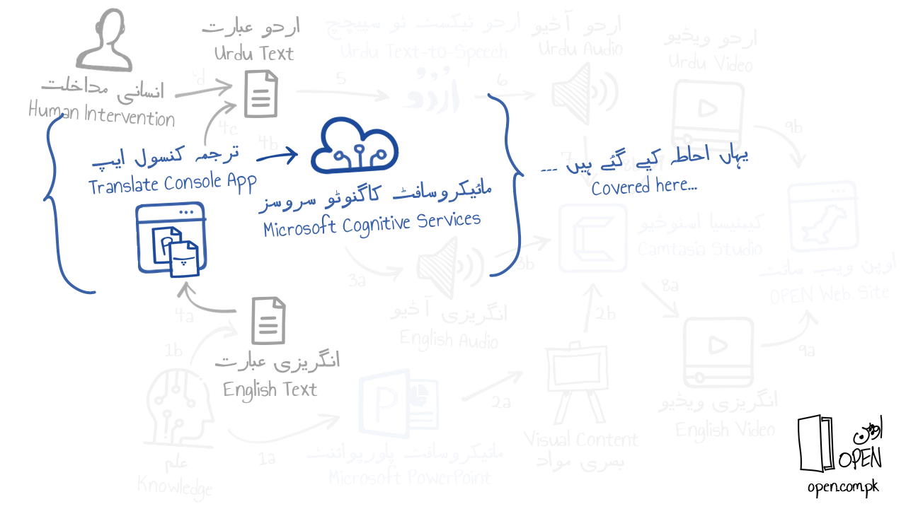

<h1 align="right">انگریزی عبارت کا اردو میں ترجمہ کرنے کے لئے مائیکروسافٹ کاگنوٹو سروسز ٹرانسلیٹر اے پی آئی کا استعمال</h1>
<h2 align="right">کیوں؟</h2>

اردو میں ترجمہ: اوپن پاکستان ایجوکیشن نیٹ ورک کورسز میں اردو آڈیو بیانیہ کے لئے اردو میں متن سے آواز کا استعمال کیا جاتا ہے۔ اس اردو عبارت کو تخلیق کرنے کے لئے مائیکرو سافٹ کاگنٹو سروسز ٹرانسلٹر اے پی آئی سے پہلے انگریزی متن کا اردو میں ترجمہ کیا جاتا ہے۔ 

<h2 align="right">کیا؟</h2>

کنسول ایپلیکیشن سے مترجم اے پی آئی کو پکارنا: یہاں کچھ بھی ایسا نہیں جس کی وصیع ساخت ہو۔ استعمال شدہ نقطہ نظر (ذیل میں ملاحظہ کریں) کچھ معمولی تبدیلیوں کے ساتھ کنسول ایپلی کیشن میں سی شارپ کوڈ (اصل میں یہاں شائع کیا گیا) کا استعمال کرتے ہوئےمترجم اے پی آئی پکارنے پر مشتمل ہے۔ 

<h2 align="right">کیسے؟</h2>

