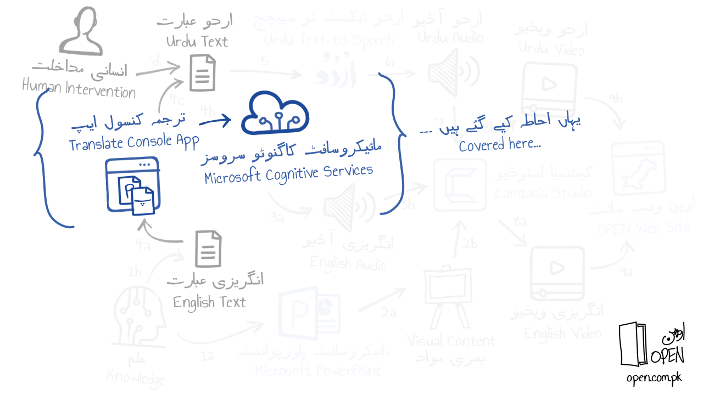

# Using Microsoft Cognitive Services Translator API to translate English text to Urdu
## Why?
_**Translation to Urdu:**_ For Urdu audio narration in OPEN (Open Pakistan Education Network) courses, an Urdu text-to-speech application in used that makes use of text in the Urdu language. To generate this Urdu text, the Microsoft Cognitive Services Translator API is called to translate English text into Urdu first.
## What?
_**Calling the Translator API from a Console Application:**_ Nothing fancy here; the approach used (see diagram below) entails calling the Translator API using C# code (originally published [here](https://github.com/MicrosoftTranslator/Text-Translation-API-V3-C-Sharp)) in a Console Application with some minor changes.

## How?
*The steps assume that you have public access to a Microsoft cloud subscription using the Azure Portal.*
1. Log into the Azure Portal and create a Translator API subscription (follow steps [here](https://docs.microsoft.com/en-us/azure/cognitive-services/translator/translator-how-to-signup)).
1. Download the source code in the _'code'_ folder to create a Visual Studio C# Console App.
1. Specify configruation settings in the _'App.Config'_ file.
1. Create a sample Engish file for translation similar to [here](https://github.com/OpenEdPakistan/speech/blob/main/files/input.txt).
1. Compile and run the console application.
1. View the generated Urdu translation (specified using the _'OutputFile'_ setting) in a text editor.
