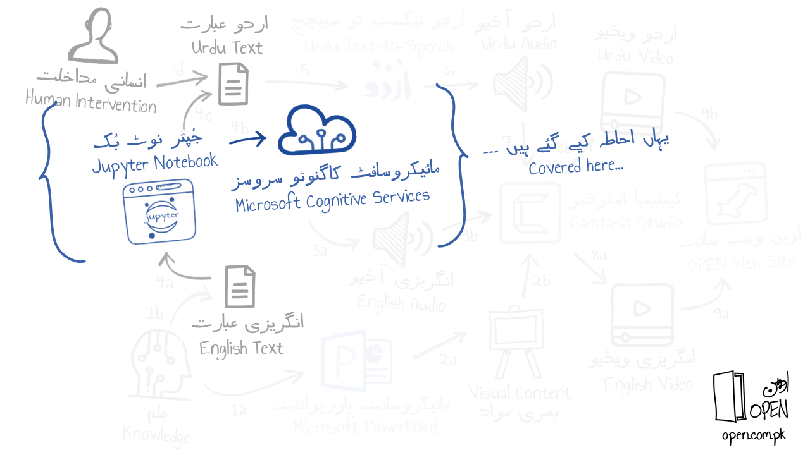
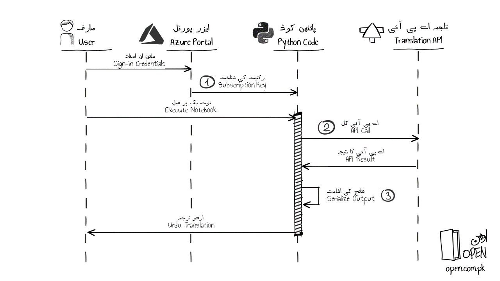

[انگریزی میں پڑھیے](README.md)
 
<h1 align="right">انگریزی عبارت کا اردو میں ترجمہ کرنے کے لئے مائیکروسافٹ کاگنوٹو سروسز ٹرانسلیٹر اے پی آئی اور پائتھن نوٹ بک کا استعمال</h1>
<h2 align="right">کیوں؟</h2>

اردو میں ترجمہ: اوپن پاکستان ایجوکیشن نیٹ ورک کورسز میں اردو آڈیو بیانیہ کے لئے اردو میں متن سے آواز کا استعمال کیا جاتا ہے۔ اس اردو عبارت کو تخلیق کرنے کے لئے مائیکرو سافٹ کاگنٹو سروسز ٹرانسلٹر اے پی آئی سے پہلے انگریزی متن کا اردو میں ترجمہ کیا جاتا ہے۔ 

<h2 align="right">کیا؟</h2>

جپیٹر نوٹ بک سے مترجم اے پی آئی کو پکارنا: ذیل میں دکھایا گیا نقطہ نظر کچھ معمولی تبدیلیوں کے ساتھ پائتھن کوڈ (اصل میں گٹ حب کے ذیلی لنک پر شائع کیا گیا) کا استعمال کرتے ہوئےمترجم اے پی آئی پکارنے پر مشتمل ہے۔ 

https://github.com/MicrosoftTranslator/Text-Translation-API-V3-Python/blob/master/Translate.py

<h2 align="right">کیسے؟</h2>

ذیلی اقدامات یہ فرض کرتے ہیں کہ ایزر پورٹل کا استعمال کرتے ہوئے آپ کو مائیکروسافٹ کلاؤڈ کی ایک عدد عوامی سبسکرپشن تک رسائی حاصل ہے۔ مندرجہ ذیل حالتی شکل ایک اعلی سطح پر عمل کو ظاہر کرتی ہے۔
 

  
 مذکورہ شکل میں نشان دہی کیے گئے 3 حصے پروگرام میں عنوانات کے مطابق ہیں۔
  
ایزر پورٹل میں لاگ ان کیجئے اور مترجم اے پی آئی تشکیل دیجئے (ذیل میں لنک پر دیے گئے مراحل کی پیروی کیجئے)۔
  
 https://docs.microsoft.com/en-us/azure/cognitive-services/translator/translator-how-to-signup
   
'نوٹ بک' فولڈر سے نوٹ بک فائل ڈاؤن لوڈ کیجئے اور اسے جپیٹر یا وژوئل اسٹوڈیو کوڈ میں دیکھئے۔ (ذیل کے دو مضامین پڑھیے)
کوڈ فائل میں تشکیل کردہ اے پی آئی کی سبسکرپشن شناخت کی وضاحت کیجئے۔
  
پائتھن کوڈ فائل امیں انگریزی کے بیانات JSON میں بیان کیجئے۔
اردو عبارت کو یونیکوڈ عنٹیٹیز کی حیثیت سے دیکھنے کیلئے نوٹ بک کے ہر سیل کو چلائیں۔
  
ذیل میں لنک پر دوسرا ٹیکسٹ ایریا استعمال کیجئے اور عنٹیٹیز کو تبدیل کرکے پیدا شدہ اردو ترجمہ دیکھیے۔
 https://www.online-toolz.com/tools/text-unicode-entities-convertor.php

