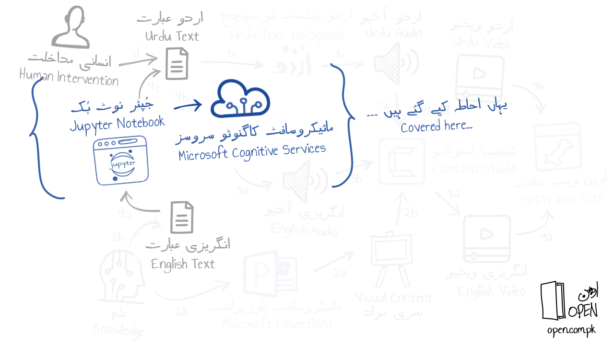

[Read in Urdu](README-Urdu.md)

# Using Microsoft Cognitive Services Translator API to translate English text to Urdu using a Jupyter Notebook
## Why?
_**Translation to Urdu:**_ For Urdu audio narration in OPEN (Open Pakistan Education Network) courses, an Urdu text-to-speech application is used that makes use of text in the Urdu language. To generate this Urdu text, the Microsoft Cognitive Services Translator API is called to translate English text into Urdu first.
## What?
_**Calling the Translator API from a Jupyter Notebook:**_ The approach shown in diagram below entails calling the Translator API using Python code (originally published [here](https://github.com/MicrosoftTranslator/Text-Translation-API-V3-Python/blob/master/Translate.py)) with some minor changes.


## How?
*The steps assume that you have public access to a Microsoft cloud subscription using the Azure Portal. The following State diagram provides a high-level view of the process.*


*The 3 parts marked in the above diagram coincide with the headings in the program .*

1. Log into the Azure Portal and create a Translator API subscription (follow steps [here](https://docs.microsoft.com/en-us/azure/cognitive-services/translator/translator-how-to-signup)).
1. Download the Python notebook file (with the .ipynb extension) from the _'notebooks'_ folder and open it Jupyter (IPython) or Visual Studio Code. (Read the 2 articles [here](https://code.visualstudio.com/docs/python/jupyter-support) and [here](https://medium.com/@udiyosovzon/how-to-activate-conda-environment-in-vs-code-ce599497f20d))
1. Specify subscription key for the created API in the code file.
1. Specify one or more statements in Engish in JSON the Python code file.
1. Run each cell of the notebook to view the tranlated text as Unicode entities.
1. View the generated Urdu translation by converting the entities using the second text-area [here](https://www.online-toolz.com/tools/text-unicode-entities-convertor.php).

### Jupyter Code (Python)
#### 1. Subscripton Key from Azure Portal
```
import os, requests, uuid, json

subscription_key = '[Insert Key here]'
endpoint = 'https://api.cognitive.microsofttranslator.com/translate?api-version=3.0'
params = '&from=en&to=ur'
constructed_url = endpoint + params

headers = {
    'Ocp-Apim-Subscription-Key': subscription_key,
    'Ocp-Apim-Subscription-Region' : 'southcentralus',
    'Content-type': 'application/json',
    'X-ClientTraceId': str(uuid.uuid4())
}
```
_**The Azure region used in the headers section of the above code is 'southcentralus'. Change to your region to use in your code.**_

#### 2. Call the Translate API
```
body = [{ 'text' : 'Welcome to Open Pakistan Education Network.' }, { 'text' : 'Learn something new or update your existing knowledge.' }, { 'text' : 'All content is available in Urdu and English.' }]
request = requests.post(constructed_url, headers=headers, json=body)
response = request.json()
```

#### 3. Serialize output from API and display to user
```
print(json.dumps(response, sort_keys=True, indent=4, separators=(',', ': ')))
```

If you want to displat the Urdu text only, use the following Python code in your notebook:
```
for item in response:
   print(item["translations"][0]["text"])
```
